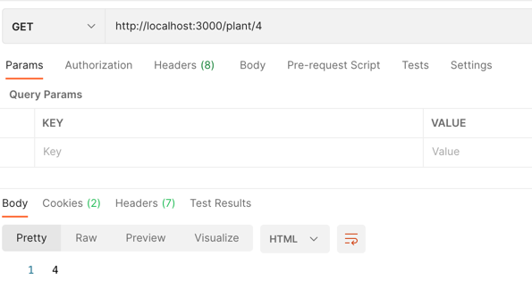
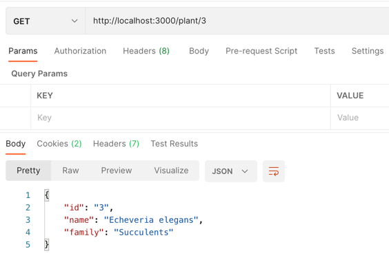

## Project Plantpedia API

### The goal of this project is to practice working with Node/JavaScript and ExpressJS framework, creating a simple CRUD API.

We will use Node, ExpressJS, and JavaScript for our project. This project is for students who want to learn how to do http requests, and we will be using [Postman](https://github.com/Projects-for-coding-women/project-plantpedia-api/blob/main/README.md#postman) for testing our API.

**Basic functionality:** we want to create an API for information about plants. CRUD stands for:

**C**reate a new plant

**R**etrieve one or all plants

**U**pdate an existing plant

**D**elete an existing plant


---

### Create the server (for more advanced students)

1. Go to the terminal and create a folder called `project-plantpedia-api`

```
mkdir project-plantpedia-api
```

2. Go inside the project and generate the `package.json`

```
cd project-plantpedia-api
npm init
```


**NB**: You only have to do npm init once when you create a project. It essentially creates the package.json. You can keep pressing 'enter' through all the options that you will see in your terminal. After this, you will see that a file called package.json has been created automatically.

**Advanced tip**: use `npm init --yes` to instantly initialise a project (without going through the list of questions).

3. Install _Express_

```
npm install express
```

4. Create a file called `server.js` in the root (= your main project folder)

```
touch server.js
```

5. Paste the following code in your `server.js` file

```
const express = require('express');
const app = express();

app.get('/', (req, res) => {
    res.send('Hello Express')
});

app.listen(3000, () => console.log("Server is up and running"))
```

We already installed Express, but we need to make sure it is included in this file, so we can use its methods. In Node.js, when you want to use a package in a file, you must **require** it.

To initialise/create our server, we need to call the express() **GET** function. In our code, `app.get` is saying that when it gets that route, it will give the response that is specified in the function. It takes in two arguments: (1) the URL (2) the function that tells Express what to send back to the person making the request. 

6. To run the application, go to the terminal, change into the root directory of the project, and type the following to start the server:

```
node server.js
```

Go to your browser or postman and type the following URL

```
http://localhost:3000/
```

You should see “Hello Express” on your screen.

**Note**: Whenever you make any changes in your project, you will have to manually restart the server. You can do this by pressing `ctrl c` on your keyboard to stop the current server and then repeat the step to start the server: `node server.js`

### GET all plants

The first thing we can add is a GET request to get all our plants

1. Go to your `server.js` file. Create an array `plantList` where you can initialize with the following list:
        
    ```js
    let plantList = [
        {
            id: "1",
            name: "Kalanchoe",
            family: "Crassulaceae"
        },
        {
            id: "2",
            name: "Chinese Money Plant",
            family: "Urticaceae"
        },
        {
            id: "3",
            name: "Echeveria elegans",
            family: "Succulents"
        },
    ]
    ```

Now modify our existing GET request to return a status 200 and this list

```
app.get('/', (req, res) => {
    res.status(200).send(plantList)
});
```

2. Run the application `node server.js` and open Postman (see
   postman [instructions](https://github.com/Projects-for-coding-women/project-plantpedia-api/blob/main/README.md#postman) below) hit send, and you should see this:
   
   
   
### GET a specific plant
1. Let's add another GET request but this time let's pass an ID to indicate which plant we want to retrieve:

```
app.get("/plant/:id", (req, res) => {
    console.log(req.params.id)
    res.status(200).send(req.params.id)
});
```

**Note**: if you want to know more about the elements of a URL there's more
info [here](https://medium.com/@joseph.pyram/9-parts-of-a-url-that-you-should-know-89fea8e11713).

2. As you can see, we are passing an ID that we can access with `req.params.id`. We can use `console.log` to see in the terminal (where you are running your app) if we are getting what we are expecting. We can also return it and see it in Postman:




3. You see that we are accessing the ID. Now let's find the plant that matches this ID and return it.

```
app.get("/plant/:id", (req, res) => {
    let plantRequested = null
    for (let plantIndex in plantList) {
        if(plantList[plantIndex].id === req.params.id) {
            plantRequested = plantList[plantIndex]
        }
    }
    res.status(200).send(plantRequested)
});
```

So if we run the app one more time and go to Postman to make this GET request we should get:



### POST, PUT and DELETE exercises

**Now is your turn!** Take what we have learned so far and try to implement the rest of the request using:

```
app.post
app.put
app.delete
```

### POST

- For the POST, we want to be able to add new plants to our plantList. Create a POST request in our `server.js`:
    - This will receive a `request body` containing an object with `name` and `family` properties. You will need to add a new element to the plantList

  ```
  {
    "name": "PlantName",
    "family": "PlantFamily"
  }
  ```
    - The ID property should be auto-generated inside our post method
    - Make the POST request return a status 200 and the plantList, including the newly created plant.

### PUT
- For the PUT request, we want to be able to update the `name` or `family` properties of our plant:
   - Add a PUT request that will receive a body with either a **name** or **family**, or **both** properties to be changed, 
   similar to the POST but remember that one or even both of them could be null. You will need to update an element from the plantList
   - You can have an extra check to see if the name or family is the same, then there is no need to update
   - Make the PUT request return a 200 and the plantList, including the recently updated plant

### DELETE
- For the DELETE request, we want to delete a specific plant:
  - Pass the ID in the request for the plant that we want to delete. You will need to remove an element from the plantList
  - Make the DELETE request return a 200 and the updated plantList (the plant that we deleted shouldn't be there anymore)

---

## Postman:
1. Download [Postman](https://www.postman.com/downloads/)
2. Once is downloaded, open it, you might see a warning, click `Open`
3. First time you open it you will see the `create an account page` you can click down on `skip and go to the app`

4. You can start by click the `+` (plus sign) to add a new request

5. Enter request url and hit `SEND` (you will see this once done the [GET exercise](https://github.com/Projects-for-coding-women/project-plantpedia-api#get-all-plants-exercise))


---

## Please note:
If you want to download a project on your local machine, do not fork it but clone the repo locally, on your computer. After that, create a new repo in your own GitHub account *with exactly the same project name*, and link the local repo to the remote repo in your GitHub account (see below). Why should you clone and not fork? It will show the project as **your own project** and not a fork of someone else's project. You can use it as a project for your portfolio.

You can connect a local project to a new, empty GitHub repo [as follows](https://docs.github.com/en/github/importing-your-projects-to-github/adding-an-existing-project-to-github-using-the-command-line). It is very good to know this so that you can start a project locally and afterwards link it with a remote GitHub repo.

If you clone the project without forking it, you will have to change the 'remote origin' repository after cloning. Check the remote of your local project using `git remote -v`. 

To link your local project to your own GitHub repo, you need to change the remote origin. Have a look at this article: https://devconnected.com/how-to-change-git-remote-origin/. With `git remote -v` you can again check if remote origin has been reset and now shows the name of your GitHub account.

---
